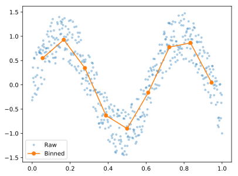
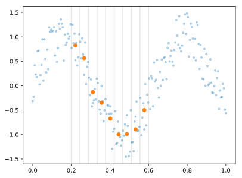

# Bindata

A convenience Python library to average noisy data over bins. Entirely based on [NumPy](https://numpy.org/).

The original idea, and initial implementation, is from A.P. Petroff.

## Quick example

Let us generate noisy data:
```Python
from pylab import *

x = linspace(0,1,500)
y = sin( 10*x ) + ( rand( len( x ) ) - .5 )
```
To average the noise out, we group the data into bins, and take the average of each bin.
```Python
from bindata import bindata
X, Y = bindata( x, y ).apply()
```
Here is the result:
```Python
plot( x, y, '.', alpha = .3)
plot( X, Y, 'o' )
```



## Choose the bins

By default, 10 bins are linearly distributed along the x axis. We can change this:
```Python
X, Y = bindata( x, y, nbins = 20, bins = 'log' ).apply()
X, Y = bindata( x, y, bins = 'equal_size' ).apply()
```
We can also set the bins by hand.
```Python
bd = bindata( x, y, bins = linspace(0.2,.6,10))
X, Y = bd.apply()

plot( x, y, '.', alpha = .3)
plot( X, Y, 'o' )

for bin_boundary in bd.bins :
    axvline( bin_boundary, color = 'k', alpha = .1 )
```



## Not just averages

The bindata object stores the data according to the binning. From that, any statistical quantity can be computed.
```Python
b = bindata( x, y, nbins = 15 )
X, Y = b.apply( mean )
sigma_x, sigma_y = b.apply( std )
```
Here is the result:
```Python
plot( x, y, '.', alpha = .3)
errorbar( X, Y, sigma_y, sigma_x, 'o' )
```


## Bin population

Some bins are populated, others are empty:
```Python
print( b.nb )
```
```console
>>> [0, 36, 36, 35, 36, 36, 35, 36, 36, 35, 36, 36, 35, 36, 35, 1]
```
By default, empty bins produce `np.nan` values.
```Python
print( b.apply()[0] )
```
```console
>>> [ nan 0.03507014 0.10721443 0.17835671 0.249499 0.32164329 0.39278557 0.46392786 0.53607214 0.60721443 0.67835671 0.750501 0.82164329 0.89278557 0.96392786 1. ]
```
To change this behavior:
```Python
b.apply( empty_as_nan = False )
```
